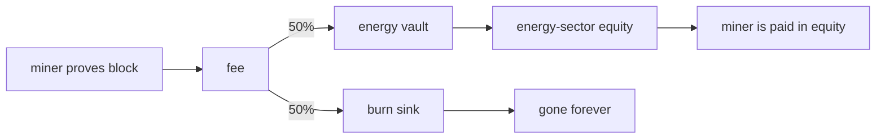

# pow-contract

Settlement contract and reference miner for **JOULE** - a mining agent that pays
miners in energy-sector equity instead of paying them in the coin it just made
scarcer.

```
mining agent. burn half, pay half in power. supply only goes one way.
```

> ## Status: soon

---

## What this is

Most proof-of-work coins pay miners in the coin they just made scarcer. That is
why they bleed: the reward *is* new supply, so every block that secures the
chain also dilutes it, and the only thing standing between the two is the
market's appetite for the new coins.

JOULE does not do that. The mining agent is paid in something else entirely:
**real energy-sector equity, bought at the moment a block is proven.** The other
half of every fee is burned. The reward never re-enters supply.

So there are three moving parts:

| Part | Role | In this repo |
| --- | --- | --- |
| `JoulePow` | Accepts a proven block, splits the fee, advances the epoch | `contracts/JoulePow.sol` |
| `IEnergyVault` | Receives the "power" half and buys equity with it | `contracts/interfaces/IEnergyVault.sol` |
| Reference miner | Finds a nonce that clears the target, then submits it | `miner/` |

---

## The split

Every accepted block splits its fee **50 / 50**, and neither half comes back:



The miner is never paid in JOULE. The miner is paid in the thing the JOULE
protocol bought with the miner's half.

---

## Supply only goes one way

The invariant the whole design hangs off:

> **There is no mint function.**

Not "minting is disabled by the owner", not "minting is capped" - there is no
code path that creates supply. Read `contracts/JoulePow.sol` and count the
`mapping` writes; every one of them either moves an existing balance or records
a burn.

That makes the two halves asymmetric on purpose:

- the **power** half is a purchase - it converts fee value into equity held on
  behalf of the miner;
- the **burn** half is a deletion - the value leaves the system entirely.

Which means the total supply curve is monotonic and downward. There is no epoch,
no difficulty and no governance vote that can bend it back up.

---

## Layout

```
pow-contract/
  contracts/
    JoulePow.sol              settlement: verify work, split fee, advance epoch
    interfaces/
      IEnergyVault.sol        the only thing JoulePow talks to downstream
    libraries/
      PowMath.sol             target maths + difficulty retarget
  scripts/
    deploy.js                 DRY RUN only - prints a plan, broadcasts nothing
    verify.js                 prints the verifier command it would have run
    mine-once.js              one mining attempt end to end, no chain needed
  miner/
    joule-miner.js            reference miner (simulation, see below)
    worker.js                 the inner nonce loop
    config.example.json       copy to config.json and edit
  test/
    pow.test.js               shape tests - they assert the scaffold is wired
  docs/
    PROTOCOL.md               the rules, written out properly
  hardhat.config.js
  package.json
  .env.example
  .gitignore
  LICENSE
```

---

## Quickstart

The scaffold has no build step of its own and no dependencies to install in
order to *read* it. To run the parts that do run:

```bash
# one mining attempt, printed to stdout, nothing submitted anywhere
node scripts/mine-once.js

# the reference miner: a few rounds of simulated settlement
node miner/joule-miner.js --config miner/config.example.json

# run it until interrupted instead of stopping after a few rounds
node miner/joule-miner.js --rounds 0

# the shape tests (no dependencies needed)
node test/pow.test.js
```

Both print a `[sim]` prefix on every line so a log can never be mistaken for a
real one. If you want the contract tooling as well:

```bash
npm install
npx hardhat compile      # may fail - see below
```

`npx hardhat compile` is expected to fail on a clean checkout. The contract
imports a placeholder interface and the tree is not pinned yet. That is the
honest state of the repository, not a bug report.

---

## Reference miner

`miner/joule-miner.js` runs the real loop shape - hash a header, compare the
digest against the epoch target, submit on a hit - but it is a **simulation**:

- it hashes with `sha256` as a stand-in for the eventual hash function;
- it never talks to a node, so a "hit" is not submitted anywhere;
- its difficulty retarget is cosmetic and its stats are generated.

It is here to pin down the interface: what a miner needs from the contract
(`epoch`, `difficulty`, `submitWork`), and what the contract needs back
(`digest`, `nonce`).

---

## What is deliberately missing

Everything below is a stub on purpose. This list is the honest diff between the
scaffold and something real.

- [ ] **The proof-of-work check.** `PowMath.meetsTarget` currently returns
      `true` for any digest. It is a placeholder so the rest of the flow can be
      exercised. A contract in this state accepts any nonce.
- [ ] **The hash function.** No keccak / SHA-256 / ASIC-resistant function has
      been chosen, so no target maths is pinned down.
- [ ] **The difficulty retarget.** `PowMath.retarget` is a stub with the
      intended shape and no arithmetic behind it.
- [ ] **The energy vault.** `IEnergyVault` is an interface with no
      implementation. Nothing in this repo can buy equity.
- [ ] **The burn sink.** The burn half is sent to a filler address rather than
      to a real sink.
- [ ] **Fee accounting.** `submitWork` is `payable` but does not yet validate
      the fee against the epoch price.
- [ ] **Replay protection across epochs.** `settled` guards a digest forever; it
      should almost certainly be scoped per epoch instead.
- [ ] **Anything to do with a chain.** No deployment, no network config, no
      verified bytecode.
- [ ] **Tests that test something.** `test/pow.test.js` asserts the scaffold is
      wired together, not that the maths is right.

---

## Disclaimers

- This code is **unaudited** and **incomplete**. Do not deploy it.
- Do not send funds to any address in this repository. They are all fillers.
- The placeholder work check means a deployment of this exact code would accept
  any nonce from anyone. That is stated here rather than discovered later.
- Nothing here is an offer, a promise of yield, or financial advice.
- The energy-equity half depends on a vault that does not exist yet. Until it
  does, the split is bookkeeping and nothing more.

---

## License

MIT - see `LICENSE`.
